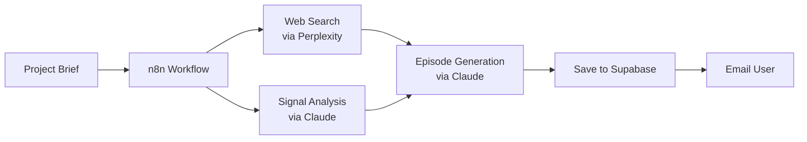

# MVP Technical Choices: Many Futures

## Core Architecture Decisions

### Frontend Stack
```typescript
// What ships in MVP
- Next.js 14 (app router) - from next-forge
- Tailwind + shadcn/ui - beautiful by default
- Clerk - auth solved
- React Email - gorgeous notifications

// What we DON'T need yet
- Websockets / real-time
- Complex state management 
- Offline support
- PWA features
```

### Backend Stack
```typescript
// MVP essentials
- Supabase (PostgreSQL + Auth helpers)
- tRPC - typesafe API from next-forge
- n8n - visual workflow debugging
- Anthropic SDK - Claude for generation

// Skip for now
- Redis / caching layer
- Queue system (n8n handles)
- Microservices
- GraphQL
```

### AI & Research Pipeline

#### MVP Research Flow (Simplified)


#### Token Budget (Per Episode)
```typescript
const MVP_LIMITS = {
  research_searches: 5,        // Down from 10
  analysis_tokens: 20_000,     // Down from 50k
  generation_tokens: 8_000,    // Focused output
  total_cost_target: 0.50,     // £0.50 per episode
  time_limit_minutes: 30       // Fast iteration
}
```

---

## Database Schema (MVP-Focused)

```sql
-- Simplified for MVP
CREATE TABLE users (
  id TEXT PRIMARY KEY,        -- Clerk ID
  email TEXT UNIQUE NOT NULL,
  created_at TIMESTAMPTZ DEFAULT NOW()
);

CREATE TABLE projects (
  id UUID PRIMARY KEY DEFAULT gen_random_uuid(),
  user_id TEXT REFERENCES users(id),
  title TEXT NOT NULL,
  status TEXT DEFAULT 'active',
  
  -- Onboarding context (denormalized for speed)
  topic TEXT NOT NULL,
  user_role TEXT,
  geographic_focus TEXT,
  time_horizon TEXT,
  
  -- Preferences learned
  speculation_tolerance TEXT DEFAULT 'balanced',
  
  created_at TIMESTAMPTZ DEFAULT NOW()
);

CREATE TABLE episodes (
  id UUID PRIMARY KEY DEFAULT gen_random_uuid(),
  project_id UUID REFERENCES projects(id),
  episode_number INT NOT NULL,
  
  -- Content
  title TEXT NOT NULL,
  slug TEXT UNIQUE NOT NULL,
  blocks JSONB NOT NULL,        -- Array of blocks
  
  -- Metadata
  research_context JSONB,       -- Sources, queries
  generation_metrics JSONB,     -- Tokens, cost, time
  
  published_at TIMESTAMPTZ DEFAULT NOW()
);

CREATE TABLE interactions (
  id UUID PRIMARY KEY DEFAULT gen_random_uuid(),
  user_id TEXT REFERENCES users(id),
  episode_id UUID REFERENCES episodes(id),
  
  -- Flexible interaction types
  type TEXT NOT NULL,           -- 'block_rating', 'episode_rating'
  target_id TEXT,               -- block_id or null
  value TEXT,                   -- 'up', 'down', '1-5'
  
  created_at TIMESTAMPTZ DEFAULT NOW()
);

-- Indexes for common queries
CREATE INDEX idx_episodes_project_id ON episodes(project_id);
CREATE INDEX idx_interactions_episode_user ON interactions(episode_id, user_id);
```

---

## MVP Deployment Strategy

### Environments
```yaml
# Minimal setup
Development:
  - Local Next.js
  - Local Supabase (Docker)
  - n8n Desktop

Staging:
  - Vercel Preview
  - Supabase Free Tier
  - n8n Cloud Trial

Production:
  - Vercel Pro ($20/mo)
  - Supabase Pro ($25/mo)  
  - n8n Starter ($20/mo)
```

### CI/CD (Bare Minimum)
```yaml
# .github/workflows/mvp.yml
on: [push]
jobs:
  typecheck:
    - runs: npm run typecheck
  deploy:
    - if: branch == main
    - runs: vercel deploy --prod
```

---

## Performance Targets (MVP)

### User-Facing
- Onboarding → First episode: <3 hours
- Episode load time: <2 seconds  
- Block rating response: <100ms
- Email delivery: <1 minute after generation

### System
- Episode generation cost: <£0.50
- Database queries per request: <5
- Memory usage: <512MB
- Error rate: <1%

---

## What We're Intentionally Skipping

### Security (Added Post-MVP)
- [ ] Rate limiting (Vercel handles basics)
- [ ] DDOS protection (Cloudflare later)
- [ ] Pen testing
- [ ] SOC2 compliance

### Scale (Not Needed Yet)
- [ ] Database read replicas
- [ ] CDN for assets
- [ ] Queue system
- [ ] Caching layer

### Features (v1.1+)
- [ ] Websocket updates
- [ ] File uploads
- [ ] Export features
- [ ] API access

---

## Development Workflow (MVP Speed)

### Daily Routine
```bash
Morning:
- Check Sentry errors
- Review yesterday's episodes
- Fix critical bugs only

Afternoon:  
- Ship one meaningful improvement
- Generate test episodes
- Gather feedback

Evening:
- Deploy to production
- Monitor early metrics
- Plan tomorrow's improvement
```

### Weekly Sprints
- Monday: Plan week's ship
- Tuesday-Thursday: Build
- Friday: Polish & deploy
- Weekend: Monitor & iterate

---

## Pre-Launch Checklist

### Technical
- [ ] Clerk auth working end-to-end
- [ ] Episode generation < 30 mins
- [ ] Emails deliver reliably
- [ ] Mobile experience perfect
- [ ] Error tracking live

### Content
- [ ] 10 sample episodes reviewed
- [ ] Onboarding flow tested with users
- [ ] Email templates gorgeous
- [ ] Block types clearly distinct

### Business  
- [ ] Stripe connected
- [ ] Terms of service
- [ ] Privacy policy
- [ ] Support email setup 