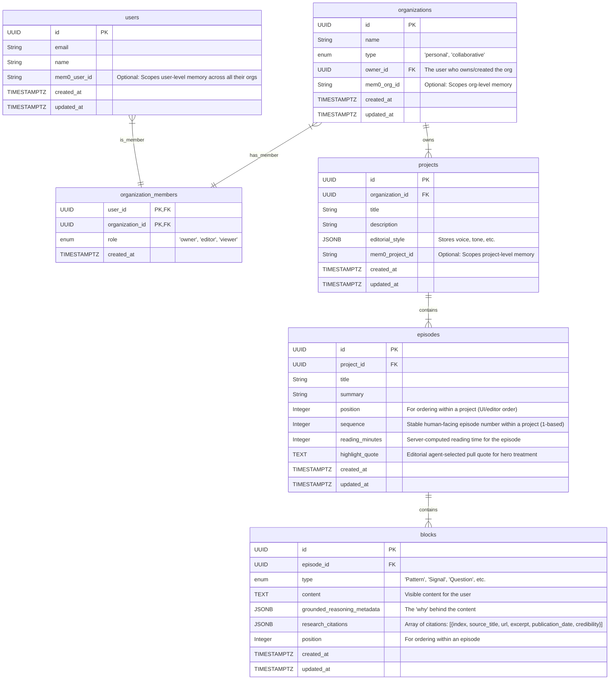

# Architecture Decision: Database Schema

**Status:** Draft
**Owners:** AI Engineering
**Related Docs:**
- [Two-Loop Memory Architecture](mdc:04-two-loop-memory-architecture.md)

---

## 1. Core Principles

This database schema is designed to support the **Uniform Team-Based Architecture**. The core idea is that the system is built for collaboration from day one, with the initial single-player experience being a specialized case of the multi-player model.

- **Team-Native:** Every `Project` belongs to an `Organization`, even if that organization is a "personal" one with a single member. This eliminates the need for complex data migrations when a user upgrades to a collaborative plan.
- **Scalable:** The structure is designed to handle users belonging to multiple organizations and to support future features like guest access and read-only sharing.
- **Mem0-Ready:** The schema includes dedicated fields (`mem0_..._id`) at the `user`, `organization`, and `project` levels to serve as the bridge to our long-term memory layer, enabling fine-grained memory scoping.

---

## 2. ER Diagram



---

## 3. Table Definitions

- **users:** Stores individual user accounts. A user can be a member of multiple organizations.
- **organizations:** Represents a workspace, which can be a single user's personal space or a collaborative team. The `type` field governs the business logic for collaboration features.
- **organization_members:** A join table defining a user's role within a specific organization.
- **projects:** The primary container for a strategic exploration. Always belongs to an organization.
- **episodes:** A single installment or "intelligence briefing" within a project.
- **blocks:** The atomic unit of content within an episode. Each block contains the visible text and the invisible context (reasoning and citations) that powers the conversational AI.

---

## 4. Design Decisions & Rationale

- **UUIDs for IDs:** Using UUIDs as primary keys is a best practice for distributed systems, preventing ID collisions and making records less guessable.
- **JSONB for Metadata:** `grounded_reasoning_metadata` and `research_citations` use JSONB to provide flexibility. We can evolve the structure of our metadata without requiring costly database schema migrations.
- **`position` for Ordering:** A simple integer field is a robust and performant way to manage the sequence of episodes and blocks.
- **Explicit `mem0` Scopes:** Having `mem0_id` fields at multiple levels (`users`, `organizations`, `projects`) gives us precise control over the scope of memory retrieval queries, which is essential for privacy and relevance.

---

## 5. MVP Working Assumptions (Draft)

- Team model: Every user receives a personal organization at sign-up (single-member). Projects are always owned by an organization. Roles start as `owner` only in MVP; `viewer` and `editor` arrive in Phase 2.
- Phased rollout: Phase 1 (MVP) focuses on individual use with optional read-only distribution. Phase 2 adds multi-member orgs and role-based permissions. Phase 3 enables membership across multiple orgs with clean context switching.
- Memory scoping: Mem0 (or fallback) keys at `user`, `organization`, and `project` to enforce strict boundaries; cross-project recall disabled by default. Cross-episode recall within a project is supported.
- Citations/metadata: Keep `grounded_reasoning_metadata` and `research_citations` as flexible JSONB; final field shapes will be iterated during MVP.
- Seeds: Provide a single deterministic demo org/project/episode for onboarding demos to keep validation runs reproducible.

These assumptions are ADR-light and will be refined as we validate the product.

---

## 6. Open Questions / HMWs (Draft)

- HMW keep ID strategy flexible (UUID vs prefixed Cuid2) until production lock‑in? Align with `01-id-and-metadata-strategy.md`.
- Do we index summaries/positions for fast cross‑episode lookups? Which composite indexes first?
- What minimal shapes for `grounded_reasoning_metadata` and `research_citations` unblock MVP while keeping migration path simple?
- Soft‑delete vs hard‑delete policies per entity; audit fields baseline.
- Multi‑tenant boundaries: ensure org_id is enforced on every query path.

---

## 7.1 Canonical Block Schema (ADR‑light)

This captures the current “episode block” contract used by the generator and renderer.

- Base fields (all blocks)
  - `id: UUID` — stable identifier
  - `episode_id: UUID`
  - `type: enum` — `coldOpen | executiveSummary | sectionHeader | text | signal | pattern | possibility | question | tension | timing`
  - `position: integer` — ascending order within episode (10, 20, 30…)
  - `content: JSONB` — visible payload (type‑specific)
  - `grounded_reasoning_metadata: JSONB` — hidden “why” used for L2 packing (not surfaced for citation)
  - `research_citations: JSONB` — auditable sources (optional per type)

- Content shapes (visible)
  - `coldOpen` — `{ paragraphs: string[] }`
  - `executiveSummary` — `{ title: string, points: string[] }`
  - `sectionHeader` — `{ title: string }`
  - `text` — `{ paragraphs: string[] }`
  - `signal` — `{ paragraphs: string[] }`
  - `pattern | possibility | tension` — `{ paragraphs: string[], keyTakeaway?: string }`
  - `question` — `{ title?: string, questions: string[] }`
  - `timing` — `{ paragraphs: string[] }`

Renderer contract: unknown `type` values must degrade gracefully with an “Unknown block type” placeholder.

Open questions (blocks)
- Do we need a first‑class `quote`/`pullquote` or `image` block for MVP?
- Minimal `research_citations` JSON shape for `signal` (allow list of sources vs single)?
- Should `grounded_reasoning_metadata` include stable keys (e.g., `assumptions`, `contradictions`, `links`) to help packing?

## 7. Future Work / Spikes (MVP)

- Deterministic seed for a demo org/project/episode to speed onboarding demos.
- Migration strategy notes: safe column additions for metadata JSONB fields; episode/block reordering.
- Vector storage choice (pgvector vs external) and initial ETL for embeddings.

### 7.a Future-safe note: Project "recent activity"
- We intentionally defer a dedicated "recent activity" sort for MVP. If/when needed, prefer a denormalized field on `projects` rather than expensive per-request aggregation:
  - Proposed column: `projects.last_activity_at timestamptz` computed as `GREATEST(next_scheduled_at, last_published_at)` (or equivalent using episode aggregation).
  - Maintenance: trigger or background job updates on episode publish and cadence updates.
  - Index: `CREATE INDEX idx_projects_last_activity ON projects (organization_id, is_paused, last_activity_at DESC);`
- Supporting index if aggregation is used: `CREATE INDEX idx_episodes_project_published ON episodes (project_id, published_at DESC) WHERE published_at IS NOT NULL;`
- Rationale: keeps the path open for a modern, scalable list view without painting us into a corner.

### 7.b Cadence → UX Label Rules (MVP-simple)
- The "Weekly Intelligence"/"Daily Intelligence" label surfaced in the UI is derived from `projects.cadence_type`.
- Mapping (display only):
  - `daily` → "Daily Intelligence"
  - `weekly` → "Weekly Intelligence"
  - `custom` → "Intelligence" (or a future-friendly formatted label based on `cadence_config`)
- Status chip: "Active" when `projects.is_paused = FALSE`; "Paused" when TRUE.
- Keep logic UI-side; no additional DB fields required. Do not over-engineer label generation in MVP.

### 7.c Future-safe note: All-time sources tracked (trust signal)
- Goal: show a total count of unique sources cited across all published episodes in a project.
- MVP-friendly approach (derived):
  - Compute `COUNT(DISTINCT canonical_source_key)` from `blocks.research_citations` joined via `episodes(project_id)` where `episodes.published_at IS NOT NULL`.
  - `canonical_source_key` = normalized citation URL domain+path (fallback to title hash when URL missing).
  - Persist in a small stats table or materialized view refreshed on episode publish:
    - `project_source_totals(project_id UUID, distinct_sources_all_time INT, last_refreshed TIMESTAMPTZ)`
- Indexes to support derivation:
  - `CREATE INDEX idx_blocks_episode ON blocks (episode_id);`
  - `CREATE INDEX idx_episodes_project_published ON episodes (project_id, published_at) WHERE published_at IS NOT NULL;`
- Production-hardening path (later, if needed):
  - Normalize citations:
    - `sources(id, canonical_url, domain, title_hash, created_at)`
    - `citations(block_id, source_id, created_at)`
  - The count becomes `COUNT(DISTINCT source_id)` for each project.

### 7.d Editorial Agent → Episode Contract (MVP)
- When the editorial agent assembles an episode, it MUST provide:
  - `sequence`: the next stable sequence number for the project (allocated server-side; agent may request the next value)
  - `reading_minutes`: computed server-side from block content (approx. words/200)
  - `highlight_quote`: a single, human-readable pull quote for hero display
- Rationale: ensures the project overview can present consistent hero metadata without recomputation in the client.

---

## 7.2 Impact of Navigation, Onboarding, and Upcoming Episodes (Draft)

This section captures changes implied by the mature navigation, conversational onboarding, and “upcoming episode” preview.

<!-- Clerk mapping note: We expect to adopt Clerk Organisations; database schema continues to model orgs natively to preserve portability. -->

### A. New/changed tables & fields (proposed)

```mermaid
erDiagram
    projects {
        UUID id PK
        UUID organization_id FK
        String title
        String description
        TEXT short_summary "Agent-authored project overview used on project page (reader non-editable)"
        JSONB editorial_style
        String mem0_project_id
        enum cadence_type "'daily','weekly','custom'" "Episode cadence (managed by agent)"
        JSONB cadence_config "Optional rules (hour of day, weekdays, timezone)"
        TIMESTAMPTZ next_scheduled_at "Next planned episode time (agent-maintained)"
        JSONB onboarding_brief "Conversational brief payload (see B)"
        BOOLEAN is_global "If true, visible to all authenticated users"
        BOOLEAN subscription_enabled "Allow follow/subscribe"
        BOOLEAN is_paused "Project temporarily paused (stops episode generation)"
        TIMESTAMPTZ created_at
        TIMESTAMPTZ updated_at
    }

    episodes {
        UUID id PK
        UUID project_id FK
        String title
        String summary
        Integer position
        enum status "'draft','scheduled','assembling','published'"
        TIMESTAMPTZ scheduled_at "Target publish time/window start"
        TIMESTAMPTZ feedback_until "Final moment user planning notes can influence (<= scheduled_at)"
        TIMESTAMPTZ assembly_started_at "Agent started generation; user input no longer affects"
        TIMESTAMPTZ published_at
        enum visibility_override "'internal','public_read','public_read_no_chat'"
        JSONB preview_questions "Key questions for upcoming"
        TIMESTAMPTZ created_at
        TIMESTAMPTZ updated_at
    }

    planning_notes {
        UUID id PK
        UUID project_id FK
        UUID user_id FK
        TEXT note "The user's verbatim feedback/request"
        enum scope "'next_episode', 'general_feedback'"
        enum status "'pending', 'consumed', 'archived'"  
        -- MVP UI note: We intentionally do NOT surface these in Project Settings.  
        -- They are created in-episode and used only to steer the next episode,  
        -- then auto-archived upon assembly to avoid long-term memory pollution.
        UUID applies_to_episode_id FK "Nullable. Which episode this note was created in response to."
        TIMESTAMPTZ expires_at "When this note is no longer considered for planning (e.g., next episode's feedback_until)"
        TIMESTAMPTZ created_at
    }

    notifications {
        UUID id PK
        UUID user_id FK
        String type "e.g., 'episode_published'"
        JSONB payload "episode_id, project_id, title, etc."
        TIMESTAMPTZ read_at
        TIMESTAMPTZ created_at
    }
```

<!-- 
Data Ownership & Flow:
- `projects.onboarding_brief` is owned by the user and captured once.
- `projects.short_summary` is owned by the agent and updated periodically.
- `planning_notes` are owned by the user, created per-episode, and are ephemeral.
-->

<!-- Rationale: Keep upcoming as a normal episode with status='scheduled'; preview content is lightweight (questions) to avoid double sources of truth. -->

### B. Conversational onboarding brief (shape)

Store the confirmed brief on the project for downstream use.

```json
{
  "project_title": "...",
  "core_question": "...",
  "user_context": {"role": "...", "location": "...", "industry": "..."},
  "research_focus": ["..."],
  "approach_preferences": {"evidence_vs_speculation": "Balanced", "time_horizon": "Near+Long"},
  "communication_style": {"tone": "Professional", "speculation_tolerance": "Open"},
  "conversation_metadata": {
    "turns": 4,
    "model": "gpt-5-mini",
    "timestamp": "2025-08-11T10:00:00Z"
  }
}
```

<!-- Uncertainty: We may later normalise parts of the brief (e.g., tags). For MVP, JSONB is acceptable. -->

### B.1 Conversation State Management (New Project Creation)

**Implementation Requirements from Prototype:**

The conversational project creation flow requires server-side state management that is NOT persisted to the database during conversation. This is handled in-memory on the server.

```typescript
// Server-side conversation state (NOT in database)
interface ConversationState {
  phase: 'exploring' | 'converging' | 'generating_brief';
  turnCount: number;
  conversationId: string;      // Temporary, from client
  previousResponseId?: string;  // GPT-5 context continuity
}

// Maintained in server memory during conversation
const conversationStates = new Map<string, ConversationState>();
```

**Key Learnings:**
1. **No Database During Conversation**: The conversation state is ephemeral and only exists in server memory
2. **Brief Storage on Confirmation**: Only when user confirms the brief is the project created in database
3. **Turn Tracking**: Essential for convergence logic (force brief at turn 5+)
4. **Response ID Chain**: GPT-5's `previous_response_id` maintains context without explicit history

**Production Considerations:**
- Server restart loses in-progress conversations (acceptable for MVP)
- Consider Redis for multi-server deployment (post-MVP)
- Brief content stored in `projects.onboarding_brief` only after confirmation
- No conversation history table needed for MVP

### C. Block schema updates (renderer-aligned)

- Add first‑class types: `quote`, `image`.
- Prefer provenance in `research_citations`; avoid embedding `source` inside `content` of `signal`.
- Renderer must degrade gracefully on unknown types (unchanged).

### D. Visibility & global projects

- Episodes default to internal visibility; allow per‑episode override via `visibility_override` when we introduce sharing.
- Global projects: flags `is_global` and `subscription_enabled`; these projects do not count toward user limits and can be surfaced in a “Global” section.

---

## 8. Indexes & Search (MVP + Future)

- MVP: Project‑level search over episodes (title, summary). Suggest `episodes_search tsvector` (GIN) filtered by `project_id`.
- Future: Block‑level search (`blocks_search tsvector`) with per‑episode scope; highlight in application layer.
<!-- Optional in MVP to control cost; enable per‑environment. -->

---

## 9. Notifications (MVP Minimal)

- Use `notifications` for in‑app alerts (episode published). Email is handled at the application layer.
- Mark‑as‑read via `read_at`.

---

## 10. Open Questions / HMWs (updated)

- HMW represent the upcoming episode preview without duplicating data?  
  <!-- Current approach: status='scheduled' + preview_questions only. -->
- Should onboarding brief fields be partially normalised (e.g., industry tags) for analytics/search?
- Minimal stable keys inside `grounded_reasoning_metadata` to support L2 packing without over‑constraining MVP?

---

## 7.3 Episode Status Lifecycle (Definitions)

<!-- Goal: Make user-facing “Upcoming” predictable and define when feedback can/can’t influence the next episode. -->

- `draft`: Internal scaffolding; not scheduled.
- `scheduled`: Visible on the Project page as “Upcoming”.  
  - Fields: `scheduled_at` (target time), `feedback_until` (last moment planning notes can influence).  
  - User feedback effect: planning notes collected until `feedback_until` may update `preview_questions`.
- `assembling`: Agent has started generation (`assembly_started_at` set).  
  - Locked: new planning notes do not affect this episode.  
  - Rationale: protects determinism for a short generation window (e.g., ~10 minutes).
- `published`: Final content is visible; immutable (except errata).  
  - `published_at` set; notifications emitted.

<!-- 
Lifecycle Guard-rails:
- `feedback_until` must be <= `scheduled_at`.
- Agent jobs (n8n, etc.) should only trigger on `status='scheduled'` and `now() >= scheduled_at`.
- The agent sets `status='assembling'` immediately upon starting work and `status='published'` upon completion.
-->

<!-- Implementation note: Transition from `scheduled` → `assembling` can be time‑based (cron) or event‑based (agent start). `feedback_until` should be <= `scheduled_at` and >= now when set. -->

---

## 11. Future Work / Spikes (Updated)

- Episode assembly triggers (n8n workflows vs direct API)
- Cross-episode search indexing strategy
- Episode lifecycle transitions (draft → scheduled → assembling → published)
- Global vs project-scoped memory architecture refinement
- Planning notes aggregation (themes vs verbatim; priority scoring)
- Block rendering contract: metadata injection timing
- Preview modes for scheduled episodes
- **Project Brief Versioning**: Add `project_brief_versions` table (id, project_id, version, purpose, research_focus, exclusions, constraints, themes_snapshot, created_at, created_by). Episodes reference `brief_version_id` to track which version was used during assembly. Changes after episode enters `assembling` state don't affect in-flight episodes.

---

## 7.3 pgvector + Three-Tier Embedding Architecture (Expert-Validated)

Based on external expert consultation, implement a sophisticated embedding strategy using separate, scoped tables optimized for our content retrieval patterns.

### Core Decisions
- **Separate embeddings tables**: Prevents write amplification when block content changes during editorial review
- **Denormalized scoping**: `project_id`, `organization_id` in embeddings tables enable fast, secure queries without joins
- **Three-tier strategy**: Block/paragraph embeddings + highlight embeddings + key takeaway embeddings
- **Raw SQL for vector ops**: Prisma lacks native vector support; use `$queryRaw` with cosine distance

### Schema Pattern

```sql
-- Paragraph-level and block-level embeddings
CREATE TABLE block_embeddings (
  id TEXT PRIMARY KEY,
  block_id TEXT NOT NULL,
  episode_id TEXT NOT NULL,     -- Denormalized for scoping
  project_id TEXT NOT NULL,     -- Denormalized for scoping  
  organization_id TEXT NOT NULL, -- Denormalized for scoping
  paragraph_index INT,          -- NULL for full-block embeddings
  embedding vector(1536),
  embedding_type TEXT NOT NULL, -- 'paragraph' | 'full_block' | 'key_takeaway'
  created_at TIMESTAMPTZ DEFAULT NOW()
);

-- User highlight embeddings (captures cross-paragraph selections)
CREATE TABLE highlight_embeddings (
  id TEXT PRIMARY KEY,
  chat_session_id TEXT NOT NULL,
  highlighted_text TEXT NOT NULL,
  project_id TEXT NOT NULL,
  episode_id TEXT NOT NULL,
  start_block_id TEXT NOT NULL,
  end_block_id TEXT NOT NULL,   -- Same as start if single block
  paragraph_indices INT[],      -- Which paragraphs spanned
  embedding vector(1536),
  created_at TIMESTAMPTZ DEFAULT NOW(),
  expires_at TIMESTAMPTZ       -- Optional cleanup after 30 days
);

-- Indexes for fast scoped retrieval
CREATE INDEX idx_block_emb_project_vector 
  ON block_embeddings USING GIN (project_id, embedding vector_cosine_ops);
CREATE INDEX idx_highlight_emb_project_vector 
  ON highlight_embeddings USING GIN (project_id, embedding vector_cosine_ops);
CREATE INDEX idx_block_emb_episode ON block_embeddings (episode_id);
CREATE INDEX idx_highlight_emb_session ON highlight_embeddings (chat_session_id);
```

### Implementation Strategy

**Three-Tier Retrieval:**
1. **Block embeddings**: Paragraph-level granularity for `signal`/`pattern` blocks; full-block for others; separate key takeaway embeddings
2. **Highlight embeddings**: Exact user-highlighted text with high relevance weighting (captures user intent)
3. **Retrieval weighting**: Highlights 1.5x, key takeaways 1.2x, paragraphs 1.0x

**Query Pattern:**
```typescript
// Raw SQL for vector similarity search with scoping
const results = await prisma.$queryRaw`
  SELECT 
    be.*,
    b.content,
    b.type,
    be.embedding <=> ${queryEmbedding}::vector as similarity
  FROM "block_embeddings" be
  JOIN "blocks" b ON b.id = be.block_id
  WHERE be.project_id = ${projectId}
    AND be.embedding <=> ${queryEmbedding}::vector < 0.5
  ORDER BY similarity
  LIMIT ${limit}
`;
```

**Context Packing for Large Windows:**
- With 128K+ context windows (GPT-4 Turbo, Claude 3.5), include aggressively:
  - Last 3 episodes (not just current)
  - All project memory
  - Relevant org-level context
- Reserve only 10% for response (vs 15% conservative)

### Migration Notes
- Start with separate tables from day 1 (correct for our use case)
- Paragraph-level embeddings for content blocks with structured paragraphs
- Highlight embeddings capture user selection behavior for improved relevance
- Scoped queries prevent cross-project data leakage