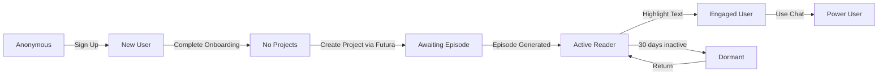

# Architecture Decision: User State Management & Progressive Disclosure

**Status:** Accepted  
**Date:** 2025-01-11  
**Owners:** Product Engineering  
**Related Docs:**
- [Database Schema](./05-database-schema.md)
- [New Project Creation Architecture](./12-new-project-creation-architecture.md)
- [Conversational UI PRD](../06-site-architecture/04-new-project-conversational-ui-prd.md)

---

## Context & Problem

Many Futures needs to provide different experiences for users at different stages of their journey. A new user needs guidance and education, while an experienced user needs quick access to advanced features. Without proper state management, we risk:

1. **Overwhelming new users** with too many features at once
2. **Boring experienced users** with repetitive onboarding
3. **Lost users** who don't understand what to do next
4. **Poor conversion** from sign-up to active usage
5. **Feature discovery issues** where users never find valuable capabilities

## Decision

We will implement a comprehensive user state management system that tracks user progression through their journey and adapts the interface accordingly. This includes:

1. **UserJourney tracking** - Database-backed milestone tracking
2. **State-driven routing** - Middleware that redirects based on user state
3. **Progressive disclosure** - Features revealed as users are ready
4. **Smart empty states** - Context-aware guidance at every step
5. **Educational spotlights** - Just-in-time feature education

## Core Architecture

### 1. User State Model

```typescript
interface UserState {
  status: 'new' | 'onboarding' | 'active' | 'dormant' | 'churned';
  
  journey: {
    hasCompletedOnboarding: boolean;
    hasCreatedFirstProject: boolean;
    hasReceivedFirstEpisode: boolean;
    hasHighlightedText: boolean;
    hasUsedChat: boolean;
    hasAddedPlanningNotes: boolean;
    lastActiveAt: Date;
  };
  
  metrics: {
    projectCount: number;
    episodeCount: number;
    highlightCount: number;
    chatMessageCount: number;
    daysActive: number;
  };
}
```

### 2. State Transitions



### 3. Database Schema

```prisma
model UserJourney {
  id                      String   @id @default(cuid())
  userId                  String   @unique @map("user_id")
  
  // Core milestones
  hasCompletedOnboarding  Boolean  @default(false) @map("has_completed_onboarding")
  hasCreatedFirstProject  Boolean  @default(false) @map("has_created_first_project")
  hasReceivedFirstEpisode Boolean  @default(false) @map("has_received_first_episode")
  hasHighlightedText      Boolean  @default(false) @map("has_highlighted_text")
  hasUsedChat            Boolean  @default(false) @map("has_used_chat")
  hasAddedPlanningNotes  Boolean  @default(false) @map("has_added_planning_notes")
  
  // Milestone timestamps
  onboardingCompletedAt  DateTime? @map("onboarding_completed_at")
  firstProjectCreatedAt  DateTime? @map("first_project_created_at")
  firstEpisodeReceivedAt DateTime? @map("first_episode_received_at")
  firstHighlightAt       DateTime? @map("first_highlight_at")
  firstChatAt           DateTime? @map("first_chat_at")
  
  // Activity tracking
  lastActiveAt          DateTime @default(now()) @map("last_active_at")
  totalActiveDays       Int      @default(0) @map("total_active_days")
  
  // Educational state
  spotlightsSeen        Json     @default("{}") @map("spotlights_seen")
  
  createdAt             DateTime @default(now()) @map("created_at")
  updatedAt             DateTime @updatedAt @map("updated_at")
  
  user                  User     @relation(fields: [userId], references: [id])
  
  @@index([userId])
  @@index([lastActiveAt])
  @@map("user_journeys")
}

model OnboardingState {
  id            String   @id @default(cuid())
  userId        String   @unique @map("user_id")
  currentStage  String   @map("current_stage") // 'welcome' | 'context' | 'project' | 'schedule' | 'complete'
  stageData     Json     @map("stage_data") // Accumulated data from each step
  startedAt     DateTime @default(now()) @map("started_at")
  expiresAt     DateTime @map("expires_at") // 7 days from start
  
  user          User     @relation(fields: [userId], references: [id])
  
  @@index([userId])
  @@index([expiresAt])
  @@map("onboarding_states")
}
```

## Implementation Patterns

### 1. Middleware-Based Routing

```typescript
// middleware.ts
export async function middleware(request: NextRequest) {
  const user = await currentUser();
  
  if (!user) {
    // Anonymous users see landing page or demo
    if (request.nextUrl.pathname.startsWith('/app')) {
      return NextResponse.redirect('/');
    }
    return NextResponse.next();
  }
  
  // Fetch user state (cached in Redis/headers)
  const state = await getUserState(user.id);
  
  // Onboarding flow enforcement
  if (!state.journey.hasCompletedOnboarding) {
    if (!request.nextUrl.pathname.startsWith('/onboarding')) {
      return NextResponse.redirect('/onboarding');
    }
  }
  
  // First project creation flow
  if (!state.journey.hasCreatedFirstProject) {
    if (request.nextUrl.pathname === '/app' || 
        request.nextUrl.pathname === '/app/projects') {
      return NextResponse.redirect('/app/projects/new');
    }
  }
  
  // Add state to headers for client components
  const response = NextResponse.next();
  response.headers.set('x-user-state', JSON.stringify(state));
  
  return response;
}
```

### 2. Progressive Feature Disclosure

```typescript
// Feature gates based on user progression
export function useFeatureGates() {
  const { userState } = useUser();
  
  return {
    // Chat unlocked after first episode
    canUseChat: userState.metrics.episodeCount > 0,
    
    // Memory settings after using chat
    canSeeMemorySettings: userState.journey.hasUsedChat,
    
    // Export after meaningful usage
    canExportContent: userState.metrics.episodeCount >= 3,
    
    // Advanced settings for engaged users
    canAccessAdvancedSettings: userState.metrics.daysActive >= 7,
    
    // Multiple projects after success with first
    canCreateMultipleProjects: userState.journey.hasReceivedFirstEpisode,
    
    // Custom cadence for power users
    canCustomizeCadence: userState.metrics.episodeCount >= 10,
  };
}
```

### 3. Smart Empty States

Each empty state adapts based on user journey stage:

```typescript
function ProjectEmptyState({ userState }: { userState: UserState }) {
  // First-time user
  if (!userState.journey.hasCreatedFirstProject) {
    return (
      <FirstProjectGuide>
        <ProjectTemplates /> {/* AI Impact, Competitor Intel, Market Trends */}
        <FuturaConversationButton />
      </FirstProjectGuide>
    );
  }
  
  // User with 1-2 projects
  if (userState.metrics.projectCount < 3) {
    return (
      <CreateAnotherProject>
        <SuccessMetrics /> {/* Show value from first project */}
        <SuggestedTopics /> {/* Based on first project */}
      </CreateAnotherProject>
    );
  }
  
  // Experienced user
  return <QuickCreateForm />;
}
```

### 4. Educational Spotlights

Just-in-time education based on user actions:

```typescript
const spotlights = {
  highlighting: {
    trigger: (state) => state.metrics.episodeCount > 0 && !state.journey.hasHighlightedText,
    content: "Try highlighting any text to save it for later",
    position: "bottom"
  },
  chat: {
    trigger: (state) => state.journey.hasHighlightedText && !state.journey.hasUsedChat,
    content: "Click the chat icon to discuss your highlights with Futura",
    position: "left"
  },
  planning: {
    trigger: (state) => state.metrics.episodeCount >= 2 && !state.journey.hasAddedPlanningNotes,
    content: "Add planning notes to influence your next episode",
    position: "top"
  }
};
```

## Special Experiences

### 1. First-Time User Onboarding

```
Welcome → Context Gathering → Project Creation (Futura) → Schedule Selection → Success
```

- Conversational project creation with Futura
- Project templates for inspiration
- Clear value proposition at each step
- Immediate episode generation after first project

### 2. Returning User (Dormant)

Users inactive for 30+ days see:
- Summary of episodes generated while away
- Key highlights from their projects
- One-click project resumption
- Updated preferences check

### 3. Demo Mode (Unauthenticated)

- Read-only sample episode
- Highlighting disabled with "Sign up to unlock"
- Chat preview showing example conversations
- Clear CTAs to sign up

### 4. Power User Features

Unlocked progressively based on engagement:
- Bulk operations (10+ episodes)
- API access (50+ episodes)
- Custom scheduling (sustained usage)
- Advanced search (high chat usage)

## Performance Considerations

### Caching Strategy

```typescript
class UserStateStore {
  // Cache in Redis for 5 minutes
  async getUserState(userId: string): Promise<UserState> {
    const cached = await redis.get(`user:${userId}:state`);
    if (cached) return JSON.parse(cached);
    
    const state = await this.buildUserState(userId);
    await redis.setex(`user:${userId}:state`, 300, JSON.stringify(state));
    
    return state;
  }
  
  // Invalidate on key actions
  async invalidate(userId: string) {
    await redis.del(`user:${userId}:state`);
  }
}
```

### Database Queries

All state queries are optimized:
- Parallel fetching of metrics
- Indexed lookups on userId
- Denormalized counts where appropriate
- Background jobs for expensive calculations

## Success Metrics

### Conversion Funnel
1. **Sign-up → Onboarding Start**: 90%
2. **Onboarding Start → First Project**: 70%
3. **First Project → First Episode Read**: 85%
4. **First Episode → First Highlight**: 60%
5. **First Highlight → First Chat**: 50%

### Engagement Metrics
- **Day 1 Retention**: User creates project
- **Day 7 Retention**: User reads 2+ episodes
- **Day 30 Retention**: User actively using chat
- **Power User**: 10+ episodes, 50+ chat messages

## Migration Strategy

### Phase 1: MVP (Week 1-2)
- Basic UserJourney table
- Onboarding flow (existing conversational UI)
- First project empty state
- Core feature gates (chat after episode)

### Phase 2: Enhancement (Week 3-4)
- Educational spotlights
- Smart empty states
- Dormant user re-engagement
- Performance caching

### Phase 3: Optimization (Post-MVP)
- Advanced feature gates
- Power user features
- A/B testing framework
- Personalized experiences

## Consequences

### Positive
- **Better activation**: Users understand what to do next
- **Higher retention**: Features revealed at right time
- **Reduced overwhelm**: Complexity hidden until needed
- **Clear progression**: Users see their journey
- **Data-driven**: Can optimize based on state metrics

### Negative
- **Added complexity**: More code to maintain
- **Cache invalidation**: Tricky edge cases
- **Testing burden**: Many states to test
- **Migration effort**: Existing users need states

### Mitigation
- Start simple with core states
- Use feature flags for gradual rollout
- Comprehensive testing suite
- Clear documentation of state logic

## Alternatives Considered

### 1. Role-Based Access Control (RBAC)
Traditional permission system based on user roles.
- **Rejected because**: Doesn't capture user journey progression

### 2. Feature Flags Only
Simple on/off switches for features.
- **Rejected because**: No context awareness or progression

### 3. Client-Side State Only
Track state in localStorage/cookies.
- **Rejected because**: Not persistent, can't analyze aggregate behavior

## Open Questions

1. **How do we handle users who skip onboarding?**
   - Allow skip but track it, provide inline education later

2. **Should power features be time-gated or usage-gated?**
   - Combination: Some by time (trust), some by usage (need)

3. **How do we test all state combinations?**
   - State factory for tests, comprehensive test matrix

4. **What about team/organization states?**
   - Future enhancement, focus on individual journey first

## Decision Log

- **2025-01-11**: Initial ADR created based on advisor feedback
- **2025-01-11**: Integrated with existing conversational UI pattern
- **2025-01-11**: Aligned with Clerk organization model

---

## Implementation Checklist

- [ ] Add UserJourney and OnboardingState to Prisma schema
- [ ] Create middleware for state-based routing
- [ ] Implement useFeatureGates hook
- [ ] Design empty state components
- [ ] Add spotlight system
- [ ] Create state tracking service
- [ ] Set up Redis caching
- [ ] Write comprehensive tests
- [ ] Document state transitions
- [ ] Create analytics dashboard

This architecture ensures that Many Futures provides the right experience to the right user at the right time, maximizing engagement and value delivery while minimizing overwhelm and confusion.