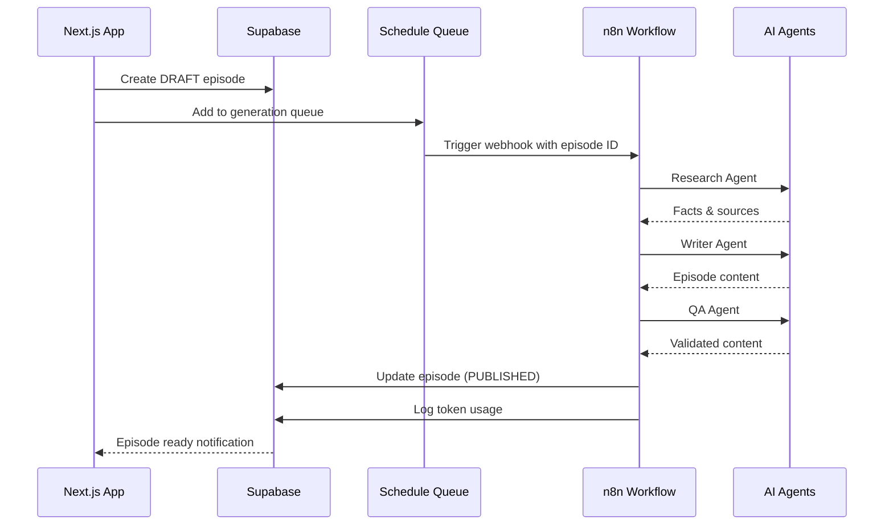

# Database & Production Implementation Plan

**Created:** 2025-08-15  
**Status:** 🟡 Planning Complete, Implementation Pending  
**Context:** Moving from prototype to production-ready application

## 🎯 Objective

Transform the Many Futures prototype (currently using mock data) into a production application with:
- Real database persistence (Supabase)
- Authentication & authorization (Clerk)
- Async episode generation (n8n)
- Production resilience patterns

## 📊 Current State vs Target State

### Current State (Prototype)
- ✅ Complete UI with mock data
- ✅ Conversational project creation flow
- ✅ Episode reading experience
- ✅ Project settings with flexible scheduling
- ❌ No database connection
- ❌ No authentication
- ❌ No API layer
- ❌ Hard-coded navigation

### Target State (Production MVP)
- ✅ All current UI features
- ✅ Supabase database with 9 critical tables
- ✅ Clerk authentication with org context
- ✅ API routes for all CRUD operations
- ✅ n8n webhook integration for episodes
- ✅ Real-time status updates
- ✅ Cost controls and monitoring

## 🔄 n8n Integration Architecture

### The Challenge
Episode generation via n8n can take 2-5 minutes:
1. Research Agent: Gathers facts (30-60s)
2. Writer Agent: Creates content (60-90s)
3. QA Agent: Validates output (30-60s)
4. Total: 2-5 minutes typical

### User Experience Strategy

#### Immediate Feedback (0-5 seconds)
```typescript
// When user triggers generation
await db.episode.create({
  status: 'DRAFT',
  projectId,
  organizationId,
  title: 'Generating your episode...',
  scheduledFor: new Date()
});

// Show immediate UI feedback
<Card>
  <Spinner />
  <h3>Creating your strategic intelligence brief</h3>
  <p>Futura is researching across multiple sources...</p>
  <ProgressSteps current={1} total={3} />
</Card>
```

#### Progress Updates (Every 30s)
```typescript
// Poll for status updates
const pollInterval = setInterval(async () => {
  const episode = await fetch(`/api/episodes/${id}/status`);
  
  if (episode.status === 'GENERATING') {
    // Update progress indicator
    updateProgress(episode.generationProgress);
  } else if (episode.status === 'PUBLISHED') {
    clearInterval(pollInterval);
    router.push(`/episodes/${id}`);
  } else if (episode.status === 'FAILED') {
    clearInterval(pollInterval);
    showError(episode.generationErrors);
  }
}, 30000);
```

#### Async Notification Options
1. **Email notification** when complete
2. **In-app notification** (bell icon)
3. **Progressive enhancement**: Start reading while still generating

### n8n Webhook Flow



## 📁 Implementation Phases

### Phase 1: Database Setup (4 hours)

#### 1.1 Supabase Project Creation
```sql
-- Create all 9 critical tables
CREATE TABLE organizations (...);
CREATE TABLE users (...);
CREATE TABLE projects (...);
CREATE TABLE episodes (...);
CREATE TABLE episode_schedule_queue (...);
CREATE TABLE token_usage_daily (...);
CREATE TABLE planning_notes (...);
CREATE TABLE user_events (...);
CREATE TABLE audit_log (...);
```

#### 1.2 Database Client
```typescript
// src/lib/db.ts
import { createClient } from '@supabase/supabase-js';
import type { Database } from './database.types';

export const supabase = createClient<Database>(
  process.env.NEXT_PUBLIC_SUPABASE_URL!,
  process.env.NEXT_PUBLIC_SUPABASE_ANON_KEY!
);

// Helper functions
export async function getProjectsByOrg(orgId: string) {
  const { data, error } = await supabase
    .from('projects')
    .select('*')
    .eq('organization_id', orgId)
    .order('updated_at', { ascending: false });
    
  if (error) throw error;
  return data;
}
```

#### 1.3 Type Generation
```bash
# Generate TypeScript types from Supabase schema
npx supabase gen types typescript --project-id=xxx > src/lib/database.types.ts
```

### Phase 2: API Routes (4 hours)

#### 2.1 Project Management
```typescript
// app/api/projects/route.ts
export async function POST(request: Request) {
  const { title, brief, organizationId } = await request.json();
  
  // Create project
  const project = await supabase.from('projects').insert({
    title,
    onboarding_brief: brief,
    organization_id: organizationId,
    status: 'ACTIVE',
    cadence_config: { mode: 'weekly', days: [1] }, // Default Monday
    next_scheduled_at: getNextMonday()
  }).select().single();
  
  // Create first episode draft
  await supabase.from('episodes').insert({
    project_id: project.id,
    organization_id: organizationId,
    status: 'DRAFT',
    scheduled_for: project.next_scheduled_at
  });
  
  // Log event
  await supabase.from('user_events').insert({
    event_type: 'project_created',
    event_data: { projectId: project.id }
  });
  
  return Response.json(project);
}
```

#### 2.2 Episode Generation
```typescript
// app/api/episodes/generate/route.ts
export async function POST(request: Request) {
  const { episodeId } = await request.json();
  
  // Update status
  await supabase.from('episodes')
    .update({ status: 'GENERATING', generation_attempts: 1 })
    .eq('id', episodeId);
  
  // Add to queue
  await supabase.from('episode_schedule_queue').insert({
    episode_id: episodeId,
    status: 'pending',
    scheduled_for: new Date()
  });
  
  // Trigger n8n webhook (async - don't await)
  fetch(process.env.N8N_WEBHOOK_URL!, {
    method: 'POST',
    headers: { 'Content-Type': 'application/json' },
    body: JSON.stringify({ 
      episodeId,
      callbackUrl: `${process.env.NEXT_PUBLIC_URL}/api/episodes/callback`
    })
  }).catch(console.error);
  
  return Response.json({ status: 'generation_started' });
}
```

#### 2.3 n8n Callback
```typescript
// app/api/episodes/callback/route.ts
export async function POST(request: Request) {
  const { episodeId, content, sources, tokenUsage, error } = await request.json();
  
  if (error) {
    // Handle failure
    await supabase.from('episodes').update({
      status: 'FAILED',
      generation_errors: [error]
    }).eq('id', episodeId);
    
    return Response.json({ status: 'failed' });
  }
  
  // Update episode with content
  await supabase.from('episodes').update({
    status: 'PUBLISHED',
    content,
    sources,
    published_at: new Date(),
    reading_minutes: calculateReadingTime(content)
  }).eq('id', episodeId);
  
  // Log token usage
  await supabase.from('token_usage').insert({
    episode_id: episodeId,
    model: tokenUsage.model,
    prompt_tokens: tokenUsage.promptTokens,
    completion_tokens: tokenUsage.completionTokens,
    total_cost: tokenUsage.cost
  });
  
  // Update queue
  await supabase.from('episode_schedule_queue')
    .update({ status: 'completed' })
    .eq('episode_id', episodeId);
  
  // Send email notification (async)
  await sendEpisodeReadyEmail(episodeId);
  
  return Response.json({ status: 'published' });
}
```

### Phase 3: Authentication (3 hours)

#### 3.1 Clerk Setup
```typescript
// app/layout.tsx
import { ClerkProvider } from '@clerk/nextjs';

export default function RootLayout({ children }) {
  return (
    <ClerkProvider>
      <html lang="en">
        <body>{children}</body>
      </html>
    </ClerkProvider>
  );
}
```

#### 3.2 Middleware
```typescript
// middleware.ts
import { authMiddleware } from '@clerk/nextjs';

export default authMiddleware({
  publicRoutes: ['/', '/sign-in', '/sign-up'],
  afterAuth(auth, req) {
    // Create personal org on first sign-in
    if (auth.userId && !auth.orgId) {
      // Redirect to org creation
    }
  }
});
```

#### 3.3 Organization Context
```typescript
// lib/auth.ts
import { auth } from '@clerk/nextjs';

export async function getCurrentOrg() {
  const { orgId, userId } = auth();
  
  if (!orgId || !userId) {
    throw new Error('Not authenticated');
  }
  
  return { orgId, userId };
}

// Use in API routes
export async function GET() {
  const { orgId } = await getCurrentOrg();
  const projects = await getProjectsByOrg(orgId);
  return Response.json(projects);
}
```

### Phase 4: Connect UI (4 hours)

#### 4.1 Project Creation
```typescript
// app/(dashboard)/projects/new/page.tsx
const handleCreateProject = async () => {
  const response = await fetch('/api/projects', {
    method: 'POST',
    body: JSON.stringify({
      title: projectBrief.title,
      brief: projectBrief.brief,
      organizationId: orgId
    })
  });
  
  const project = await response.json();
  router.push(`/projects/${project.id}`); // Real ID!
};
```

#### 4.2 Data Fetching
```typescript
// app/(dashboard)/projects/page.tsx
export default async function ProjectsPage() {
  const { orgId } = await getCurrentOrg();
  const projects = await supabase
    .from('projects')
    .select('*, episodes(count)')
    .eq('organization_id', orgId);
    
  return <ProjectsList projects={projects} />;
}
```

#### 4.3 Settings Persistence
```typescript
// app/(dashboard)/projects/[id]/settings/page.tsx
const handleSave = async () => {
  await fetch(`/api/projects/${projectId}`, {
    method: 'PATCH',
    body: JSON.stringify({
      cadence_config: {
        mode: 'custom',
        days: selectedDays
      }
    })
  });
  
  // Optimistic update
  setProject(prev => ({
    ...prev,
    cadenceConfig: { mode: 'custom', days: selectedDays }
  }));
};
```

### Phase 5: Production Patterns (3 hours)

#### 5.1 Queue Processing
```typescript
// lib/queue.ts
export async function processEpisodeQueue() {
  // Get pending episodes with row locking
  const { data: pending } = await supabase.rpc('get_pending_episodes', {
    sql: `
      SELECT * FROM episode_schedule_queue 
      WHERE status = 'pending' 
      AND scheduled_for <= NOW()
      FOR UPDATE SKIP LOCKED
      LIMIT 1
    `
  });
  
  if (!pending?.length) return;
  
  const episode = pending[0];
  
  try {
    await triggerN8nGeneration(episode.id);
    await updateQueueStatus(episode.id, 'processing');
  } catch (error) {
    await handleQueueError(episode.id, error);
  }
}
```

#### 5.2 Cost Controls
```typescript
// lib/cost-control.ts
export async function checkDailyLimit(orgId: string): Promise<boolean> {
  const { data } = await supabase
    .from('token_usage_daily')
    .select('total_cost_gbp')
    .eq('organization_id', orgId)
    .eq('date', new Date().toISOString().split('T')[0])
    .single();
    
  if (data?.total_cost_gbp >= 50) {
    // Circuit breaker triggered
    await supabase.from('user_events').insert({
      event_type: 'daily_limit_exceeded',
      event_data: { cost: data.total_cost_gbp }
    });
    
    return false;
  }
  
  return true;
}
```

#### 5.3 Event Tracking
```typescript
// lib/events.ts
export async function trackEvent(
  eventType: string,
  eventData?: any
) {
  const { userId, orgId } = await getCurrentOrg();
  
  await supabase.from('user_events').insert({
    user_id: userId,
    organization_id: orgId,
    event_type: eventType,
    event_data: eventData,
    created_at: new Date()
  });
}

// Usage
await trackEvent('episode_opened', { episodeId, duration: 0 });
await trackEvent('settings_updated', { changes: diff });
await trackEvent('feedback_submitted', { rating: 4 });
```

## 📋 Implementation Checklist

### Day 1: Foundation
- [ ] Create Supabase project
- [ ] Set up tables with migrations
- [ ] Generate TypeScript types
- [ ] Create database client wrapper
- [ ] Implement project CRUD API
- [ ] Test project creation flow

### Day 2: Integration
- [ ] Set up Clerk authentication
- [ ] Add organization context
- [ ] Implement episode generation API
- [ ] Create n8n webhook endpoint
- [ ] Add progress polling UI
- [ ] Test async generation flow

### Day 3: Production
- [ ] Implement queue processing
- [ ] Add cost control checks
- [ ] Set up event tracking
- [ ] Add error recovery
- [ ] Test edge cases
- [ ] Deploy to staging

## 🚨 Critical Considerations

### Episode Generation UX
1. **Set Expectations**: "Episodes typically take 2-5 minutes to generate"
2. **Show Progress**: Research → Writing → Review stages
3. **Allow Navigation**: User can browse while waiting
4. **Email Fallback**: Send notification if user leaves
5. **Error Recovery**: Clear retry options if generation fails

### Race Conditions
- Use `FOR UPDATE SKIP LOCKED` for queue processing
- Implement optimistic locking for concurrent edits
- Add idempotency keys for webhook callbacks

### Cost Management
- Check limits BEFORE triggering generation
- Aggregate costs in real-time
- Implement circuit breakers
- Alert on approaching limits

### Error Handling
```typescript
// Graceful degradation pattern
try {
  // Primary path
  await generateViaWebhook();
} catch (error) {
  // Fallback path
  await addToRetryQueue();
  // Notify user
  await sendDelayNotification();
}
```

## 📊 Success Metrics

1. **Project Creation**: < 10s from conversation to project page
2. **Episode Generation**: < 5 minutes typical, < 10 minutes max
3. **Database Queries**: < 100ms for list views
4. **Error Rate**: < 1% for critical paths
5. **Cost Control**: Never exceed daily limits

## 🔗 Related Documents

- [Database Schema](../database-schema.ts)
- [Edge Cases to Test](./edge-cases-to-test.md)
- [Context Recovery Guide](./context-recovery.md)
- [n8n Workflow Documentation](../PRDs-ADRs/n8n-integration.md)

---

**Remember**: This plan is our source of truth for the production implementation. Update as we progress!